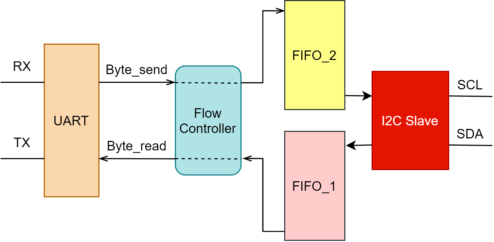

# I2C Slave <=> UART Controller
- This project provides a way to talk with I2C masters via a UART port, which means any computer with a UART port can be configured as an I2C slave device using this IP core.
- Don't worry about synchronization, the I2C slave controller will keep stretching SCL until your data at PC side is ready.
- The block diagram of this project is shown bellow:

  